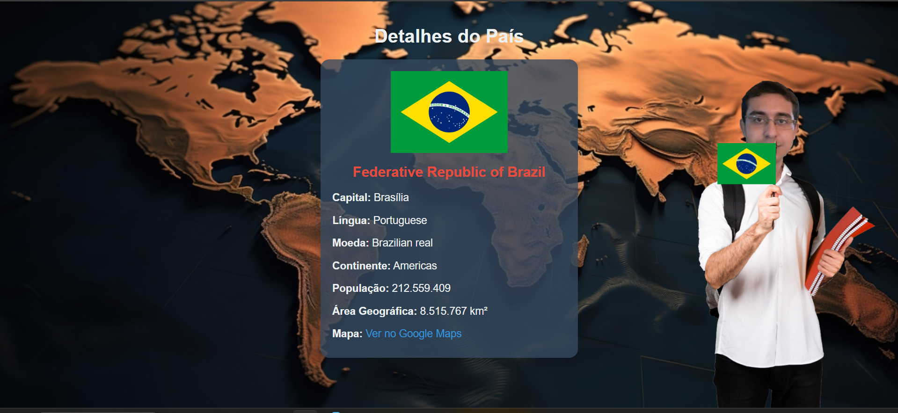

# Projeto de Busca de Países

 <!-- Coloque aqui uma URL de uma imagem representativa do seu projeto -->

## Índice

- [Descrição do Projeto](#descrição-do-projeto)
- [Objetivos](#objetivos)
- [Tecnologias Utilizadas](#tecnologias-utilizadas)
- [Funcionalidades](#funcionalidades)
- [Tela de Detalhes do País](#tela-de-detalhes-do-país)
- [Como Executar o Projeto](#como-executar-o-projeto)
- [Exemplos de Uso](#exemplos-de-uso)
- [Testes](#testes)
- [Contribuição](#contribuição)
- [Licença](#licença)

## Descrição do Projeto

O **Projeto de Busca de Países** é uma aplicação web interativa que permite aos usuários buscar e visualizar informações sobre diferentes países de forma rápida e fácil. A interface é projetada para ser amigável e intuitiva, proporcionando uma experiência de usuário agradável. O projeto utiliza a API RestCountries para obter dados atualizados sobre países e suas características.

### Objetivos

- Facilitar a pesquisa de informações sobre países.
- Aprender a manipular animações CSS e responsividade.
- Criar uma interface amigável e acessível.
- Aprofundar conhecimentos em JavaScript e integração com APIs.

## Tecnologias Utilizadas

- **HTML**: Estruturação do conteúdo da página.
- **CSS**: Estilização e animação da interface, utilizando [Google Fonts](https://fonts.google.com/) para tipografia (Fonte: Montserrat).
- **JavaScript**: Implementação das funcionalidades de busca e filtragem de países.
- **API RestCountries**: Para obter informações atualizadas sobre os países.
- **Git**: Controle de versão e gerenciamento do código-fonte.

## Funcionalidades

- **Buscador de Países**: Permite aos usuários buscar países por nome, filtrando os resultados em tempo real.
- **Exibição de Bandeiras**: Mostra bandeiras dos países, com animação ao passar o mouse, proporcionando um efeito visual dinâmico.
- **Design Responsivo**: A página se adapta a diferentes tamanhos de tela, garantindo usabilidade em dispositivos móveis e desktops.
- **Interface Moderna**: Uso de sombras, transições suaves e uma paleta de cores elegante para um visual atraente.
- **Tela de Detalhes**: Apresenta informações detalhadas sobre cada país, acessíveis através de um clique na lista de resultados.

## Tela de Detalhes do País



A tela de detalhes do país é uma interface interativa que exibe informações específicas sobre um país escolhido. Ao clicar em um país na lista, o usuário é redirecionado para uma nova página que apresenta:

- **Bandeira do País**: A bandeira é exibida em tamanho adequado, acima das informações do país.
- **Nome Oficial**: O nome oficial do país.
- **Capital**: A capital do país.
- **Línguas**: Lista das línguas faladas no país.
- **Moeda**: A moeda utilizada no país.
- **Região**: A região em que o país está localizado.
- **População**: A população total do país, formatada para melhor legibilidade.
- **Área**: A área total do país em quilômetros quadrados.
- **Link para o Mapa**: Um link que direciona para o Google Maps, mostrando a localização do país.

A interface é responsiva e otimizada para diferentes tamanhos de tela, garantindo uma experiência de usuário fluida e acessível.

## Como Executar o Projeto

Para executar este projeto localmente, siga os passos abaixo:

1. **Clone o repositório**:
   ```bash
   git clone https://github.com/geovane833/Buscador_paises.git
