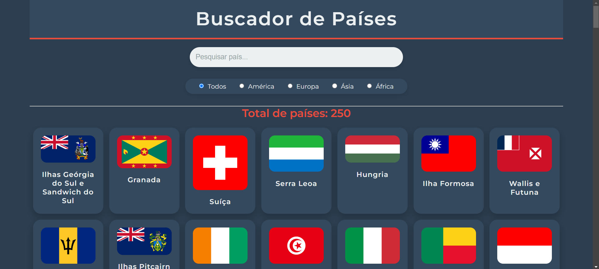

# Projeto de Busca de Países

 <!-- Coloque aqui uma URL de uma imagem representativa do seu projeto -->

## Índice

- [Descrição do Projeto](#descrição-do-projeto)
- [Tecnologias Utilizadas](#tecnologias-utilizadas)
- [Funcionalidades](#funcionalidades)
- [Como Executar o Projeto](#como-executar-o-projeto)
- [Exemplos de Uso](#exemplos-de-uso)
- [Contribuição](#contribuição)
- [Licença](#licença)

## Descrição do Projeto

O Projeto de Busca de Países é uma aplicação web interativa que permite aos usuários buscar e visualizar informações sobre diferentes países. A interface inclui um campo de busca que filtra os países em tempo real, proporcionando uma experiência de usuário dinâmica e intuitiva.

### Objetivos

- Facilitar a pesquisa de informações sobre países.
- Aprender a manipular animações CSS e responsividade.
- Criar uma interface amigável e acessível.

## Tecnologias Utilizadas

- **HTML**: Estruturação do conteúdo da página.
- **CSS**: Estilização e animação da interface.
  - [Google Fonts](https://fonts.google.com/) para a tipografia (Fonte: Montserrat).
- **JavaScript**: (se utilizado) Para a funcionalidade de busca e filtragem de países.

## Funcionalidades

- **Buscador de Países**: Permite aos usuários buscar países por nome, filtrando os resultados em tempo real.
- **Exibição de Bandeiras**: Mostra bandeiras dos países, com animação ao passar o mouse, proporcionando um efeito visual dinâmico.
- **Design Responsivo**: A página se adapta a diferentes tamanhos de tela, garantindo usabilidade em dispositivos móveis e desktops.
- **Interface Moderna**: Uso de sombras, transições suaves e uma paleta de cores elegante para um visual atraente.

## Como Executar o Projeto

Para executar este projeto localmente, siga os passos abaixo:

1. **Clone o repositório**:
   ```bash
   git clone https://github.com/geovane833/Buscador_paises.git
